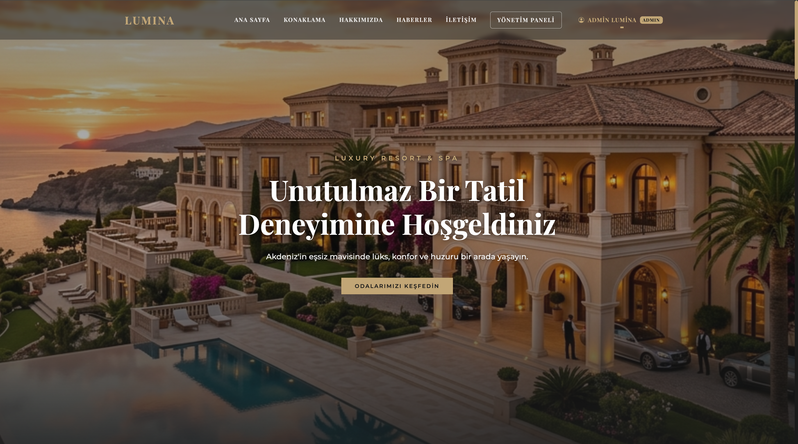
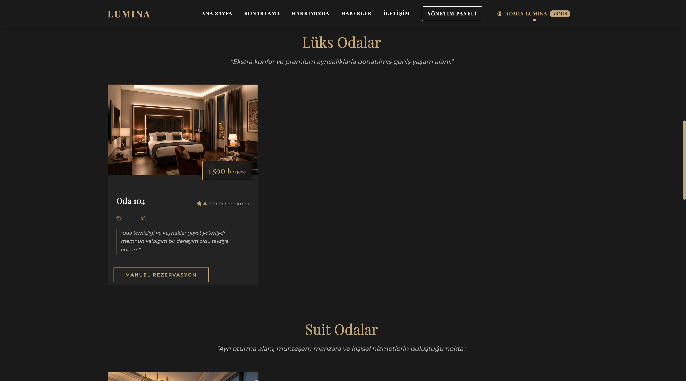
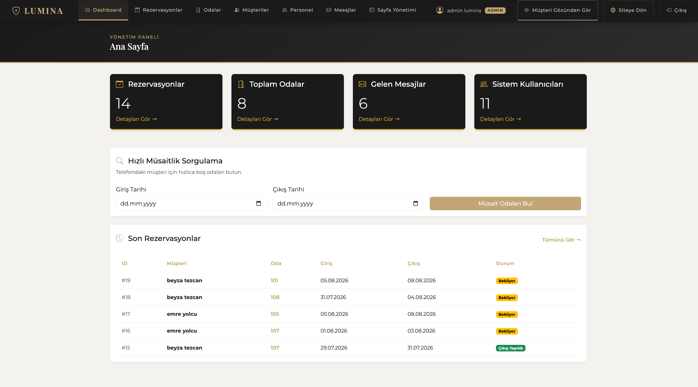
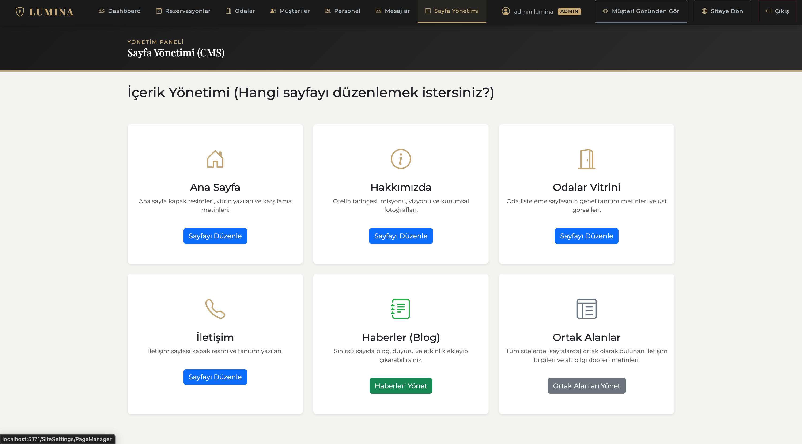

# 🏨 Lumina Resort & SPA - Tam Kapsamlı Otel Yönetim Sistemi

ASP.NET Core MVC ile geliştirilmiş, lüks ve modern bir arayüze sahip, dinamik CMS (İçerik Yönetim Sistemi), rol tabanlı yetkilendirme ve akıllı takvim entegrasyonu barındıran full-stack bir otel rezervasyon platformudur.



## 🌟 Öne Çıkan Özellikler (V2 Güncellemesi)

- **Tamamen Dinamik İçerik Yönetimi (Headless CMS):** Ana sayfa, Hakkımızda, Odalar ve İletişim sayfalarındaki tüm metin ve görseller kod yazmadan Admin Paneli üzerinden, **Müşteri Gözünden Gör** ekranındaki *Inline Editor* (Canlı Düzenleyici) ile anında değiştirilebilir.
- **Lüks ve Modern Frontend Tasarımı:** UI/UX prensiplerine uygun, altın (gold) ve koyu tema ağırlıklı, premium hissiyatı veren responsive tasarım.
- **Rol Bazlı Yönetim (RBAC):** Admin, Resepsiyonist, Pazarlama (Marketing) ve Müşteri rolleri için tamamen izole edilmiş sayfa erişimleri.
- **Akıllı Rezervasyon ve Takvim:** Geçmiş tarihe veya aynı güne alınan rezervasyonları engelleyen, dolu günleri takvimde kilitleyen akıllı doğrulama sistemi.
- **Entegre Blog (Haber) Sistemi:** Otelle ilgili haberleri ve kampanyaları yayınlayabileceğiniz yönetim arayüzü.
- **Mail Bildirimleri:** Rezervasyon onayları ve iletişim formu taleplerinin e-posta ile otomatik iletilmesi.

## 🛠️ Teknoloji Yığını

| Teknoloji | Kullanım Amacı |
|-----------|---------------|
| **ASP.NET Core 10** | Web sunucusu ve MVC (Model-View-Controller) çatısı |
| **Entity Framework Core** | ORM (Veritabanı işlemleri) |
| **PostgreSQL** | İlişkisel veritabanı (Performanslı ve güvenli veri saklama) |
| **Riok.Mapperly** | Compile-time DTO ↔ Entity dönüşümü |
| **Bootstrap 5 & Vanilla CSS** | Modern ve responsive arayüz tasarımı |
| **CKEditor 5 (Inline)** | Canlı sayfa içi içerik düzenleme (CMS) |
| **Flatpickr** | Akıllı tarih seçici (Rezervasyon takvimi) |
| **Cookie Authentication** | Güvenli oturum ve rol (RBAC) yönetimi |
| **Swagger (OpenAPI)** | RESTful API test arayüzü |

---

## 📸 Sistemden Görünümler

### Odalar ve Müşteri Paneli

*Müşteriler, oda detaylarını inceleyebilir, yorumlara göz atabilir ve müsaitlik durumuna göre anında rezervasyon yapabilir.*

### Yönetim Paneli - Ana Sayfa

*Otelin genel durumu, anlık müsaitlik sorgulama ve son rezervasyonları görebileceğiniz özet ekranı.*

### Sayfa Yönetimi (CMS)

*Pazarlama ve yöneticilerin hiçbir kod bilgisine ihtiyaç duymadan sitenin her alanını güncelleyebildiği bölüm.*

---

## 👥 Roller ve Yetkiler Modeli

### 1. Yönetici (Admin)
- Sistemin mutlak hakimidir.
- Müşteri, Personel (yetki atama dahil) ve Oda yönetimini (CRUD) tam erişimle gerçekleştirir.
- Tüm sayfa içeriklerini (CMS) düzenleyebilir.
- Manuel rezervasyon yapabilir veya var olanları silebilir.

### 2. Resepsiyonist (Receptionist)
- Sadece `Dashboard` ve `Rezervasyonlar` modüllerine erişebilir.
- Müşteriler adına manuel rezervasyon yapabilir.
- Rezervasyon durumlarını "Check-in", "Check-out" veya "İptal Edildi" olarak güncelleyebilir. Sistemi silemez, sadece yönetebilir.

### 3. Pazarlama (Marketing)
- Yalnızca `Blog (Haberler)` ve `Sayfa Yönetimi (CMS)` modüllerine erişir.
- Sitenin ön yüzündeki resimleri, sloganları ve tanıtım metinlerini değiştirir. Kampanyaları yönetir.
- Rezervasyon veya müşteri gizliliği gerektiren alanlara erişimi yoktur.

### 4. Müşteri (Customer)
- Sadece `Müşteri Paneli` modüllerine erişir.
- Akıllı takvim ile online rezervasyon yapar (dolu günler kırmızı ve tıklanamaz).
- Konaklaması biten odalara puan/değerlendirme bırakabilir.
- Kendi rezervasyon geçmişini görüntüleyebilir. Şifre ve profil güncelleyebilir.

---

## 📐 Proje Mimarisi

Proje **Katmanlı Mimari (Layered Architecture)** prensibiyle inşa edilmiş olup RESTful API ve MVC yapılarını bir arada çalıştırabilmektedir:

```text
otelrezervation/
├── Models/          → Entity sınıfları (Tablolar) ve AppDbContext
├── DTOs/            → Dış dünyaya açılan güvenli Veri Aktarım Nesneleri
├── Mappings/        → Entity ↔ DTO dönüşüm profilleri (Mapperly)
├── Services/        → İş Kuralları (Business Logic / DI ile enjekte edilir)
├── Controllers/
│   ├── Api/         → JSON dönen dışa açık servisler
│   └── Web/         → Arayüzü (HTML/CSS) oluşturan MVC Controller'lar
├── Views/           → Razor (.cshtml) arayüz şablonları
└── wwwroot/         → Statik dosyalar (CSS, JS, Resimler)
```

## 🚀 Kurulum Adımları

1. **Gereksinimler:**
   - .NET 10 SDK
   - PostgreSQL veritabanı

2. **Projeyi Klonlama:**
   ```bash
   git clone https://github.com/beyzatezcan/OtelRezervasyonAPI.git
   cd OtelRezervasyonAPI
   ```

3. **Veritabanı Ayarları:**
   `appsettings.json` dosyasındaki `DefaultConnection` satırını kendi yerel PostgreSQL sunucu bilgilerinize göre (Host, Port, User, Password, Database) güncelleyin.

4. **Migration (Veritabanı Oluşturma):**
   ```bash
   dotnet ef database update
   ```

5. **Uygulamayı Başlatma:**
   ```bash
   dotnet run
   ```

6. **Varsayılan Test Girişleri:**
   *Sistemi test etmek için Auth menüsünden kayıt olabilir, ardından Personel Yönetimi sayfasından rolünüzü Admin yaparak tüm menüleri aktif edebilirsiniz.*
